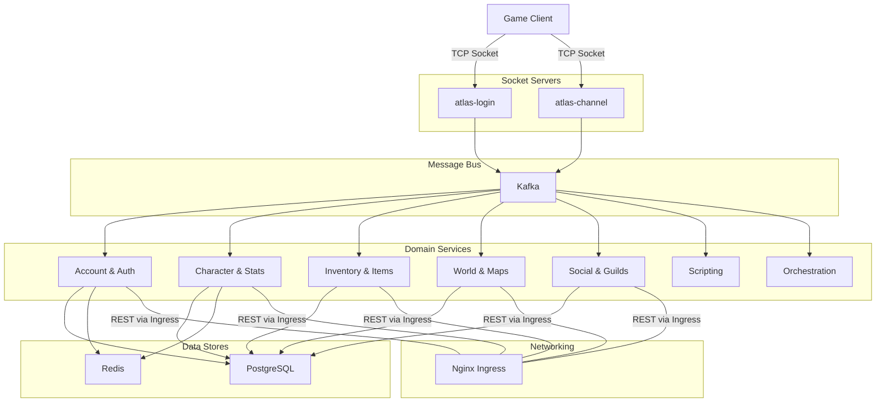
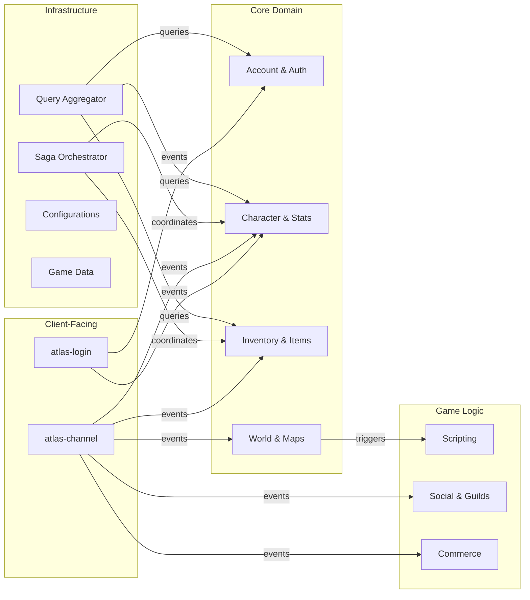

# Atlas

A MapleStory game server emulator built as a Go microservices architecture. Atlas breaks down the game server into 56 independently deployable services communicating over Kafka, backed by PostgreSQL and Redis, with a Next.js admin frontend.

[](https://github.com/Chronicle20/atlas/actions/workflows/pr-validation.yml)
[](https://github.com/Chronicle20/atlas/actions/workflows/main-publish.yml)

## Architecture



**Game clients** connect to `atlas-login` via TCP sockets. After authentication, they are handed off to `atlas-channel` which handles real-time gameplay. Both servers publish events to **Kafka**, which domain services consume to handle game logic (inventory management, character updates, quests, etc.). Domain services expose **REST APIs** for inter-service queries and use **PostgreSQL** for persistence and **Redis** for caching.

Inter-service REST calls are routed through a central **Nginx ingress proxy** — all services share a single `BASE_SERVICE_URL` and the ingress routes requests to the correct backend based on URL path (e.g., `/api/accounts/*` → `atlas-account`). In Kubernetes, this is backed by standard service DNS.

The system supports **multi-tenancy** — a single deployment can host multiple MapleStory game versions (e.g., GMS v83, GMS v95) simultaneously. Each tenant is identified by a combination of region, major version, and minor version. Tenant context propagates through Kafka message headers, REST request headers (`TENANT_ID`, `REGION`, `MAJOR_VERSION`, `MINOR_VERSION`), and is scoped in database queries. Services like `atlas-login` and `atlas-channel` register handlers per tenant, allowing version-specific packet encoding and game behavior within one cluster.

## Getting Started

### Prerequisites

| Dependency | Version | Notes |
|------------|---------|-------|
| Go | 1.25.5+ | All backend services |
| Node.js | 22+ | atlas-ui only |
| Docker | Latest | Service containerization |
| Kafka | 3.x+ | Event bus between all services |
| PostgreSQL | 14+ | Per-service databases (e.g., `atlas-accounts`, `atlas-characters`) |
| Redis | 7+ | Caching layer (effective stats, sessions) |
| Nginx | Latest | Ingress proxy for inter-service REST routing |

For Kubernetes deployments, infrastructure secrets (DB credentials, etc.) are configured in `base.yaml`. The shared ConfigMap (`atlas-env`) in `services/atlas-env.yaml` defines connection endpoints for all services.

### Running Locally

Each service runs as a standalone binary on port 8080. Services communicate asynchronously through Kafka events and synchronously through REST calls routed via the Nginx ingress.

```bash
# Tidy all Go modules
./tools/tidy-all-go.sh

# Run all tests
./tools/test-all-go.sh

# Build all Docker images
./tools/build-services.sh
```

### Kubernetes Deployment

Atlas is designed to run on Kubernetes. Base infrastructure is defined in `base.yaml` (namespace + secrets), with per-service manifests in each service directory and an nginx ingress in `atlas-ingress.yml`.

```bash
# Apply base infrastructure
kubectl apply -f base.yaml

# Deploy a service
kubectl apply -f services/atlas-account/atlas-account.yml

# Deploy ingress
kubectl apply -f atlas-ingress.yml
```

## Project Structure

```
atlas/
├── services/          # 56 microservices
├── libs/              # 13 shared Go libraries
├── tools/             # Build and maintenance scripts
├── dev/               # Development plans and audits
├── .github/           # CI/CD workflows and config
├── base.yaml          # K8s namespace and secrets
├── atlas-ingress.yml  # Nginx ingress routing
└── go.work            # Go workspace
```

## Services

The following diagram shows how service groups interact at a high level:



### Connection & Authentication

| Service | Description |
|---------|-------------|
| atlas-login | TCP socket server — client authentication and server selection |
| atlas-channel | TCP socket server — real-time gameplay sessions |
| atlas-world | World/server management and channel coordination |
| atlas-account | Account creation, authentication, and management |
| atlas-ban | IP/HWID/account ban enforcement and login history |

### Character

| Service | Description |
|---------|-------------|
| atlas-character | Character CRUD and attributes |
| atlas-character-factory | Character creation pipeline (template selection, saga-driven creation) |
| atlas-effective-stats | Recomputed character stats (base + equipment + buffs), cached in Redis |
| atlas-skills | Character skill trees and levels |
| atlas-buffs | Active buff tracking and expiration |
| atlas-keys | Key binding configuration |
| atlas-expressions | Character facial expression state and revert timing |
| atlas-fame | Fame/reputation system |

### Inventory & Items

| Service | Description |
|---------|-------------|
| atlas-inventory | Inventory slot and item management |
| atlas-consumables | Applies effects when items are used (potions, scrolls, summoning, etc.) |
| atlas-asset-expiration | Periodic cleanup of time-limited items across online sessions |
| atlas-storage | Warehouse/storage system |
| atlas-cashshop | Cash shop browsing and purchases |
| atlas-gachapons | Gacha/random reward machines |
| atlas-pets | Pet summoning and behavior |

### World & Maps

| Service | Description |
|---------|-------------|
| atlas-maps | Map instance management and character presence |
| atlas-portals | Portal definitions and validation |
| atlas-monsters | Monster spawning and state |
| atlas-monster-death | Monster death event handling and loot resolution |
| atlas-drops | Ground item/meso drop management |
| atlas-drop-information | Drop table definitions |
| atlas-reactors | Reactor objects on maps |
| atlas-transports | Ship/transport scheduling |
| atlas-chairs | Chair placement tracking |
| atlas-chalkboards | Chalkboard message display |

### Scripting

Services that execute JSON-based game scripts in response to player actions.

| Service | Description |
|---------|-------------|
| atlas-npc-conversations | NPC dialogue trees and branching logic |
| atlas-portal-actions | Script execution on portal entry |
| atlas-map-actions | Script execution on map entry (`onUserEnter`, `onFirstUserEnter`) |
| atlas-reactor-actions | Script execution on reactor interaction |

### Social

| Service | Description |
|---------|-------------|
| atlas-buddies | Friend list management |
| atlas-guilds | Guild creation, membership, and ranks |
| atlas-parties | Party formation and management |
| atlas-party-quests | Party quest instance coordination |
| atlas-families | Family tree hierarchy with reputation and EXP sharing |
| atlas-marriages | Marriage system |
| atlas-messengers | Maple Messenger chat rooms |
| atlas-notes | Persistent player-to-player notes/memos |
| atlas-invites | Generic invitation handling (guild, party, family, marriage) with timeout cleanup |

### Commerce

| Service | Description |
|---------|-------------|
| atlas-npc-shops | NPC shop inventories and transactions |

### Orchestration & Infrastructure

| Service | Description |
|---------|-------------|
| atlas-saga-orchestrator | Distributed saga coordinator for multi-step operations |
| atlas-runtime-orchestrator | Runtime lifecycle management |
| atlas-query-aggregator | Read-only REST aggregator — composes queries across multiple domain services |
| atlas-messages | Command dispatcher — processes GM and chat commands (warp, award, kill, etc.) |
| atlas-rates | Per-character experience and drop rate multipliers |
| atlas-quest | Quest tracking and completion |
| atlas-tenants | Tenant identity management (game versions, server instances) |
| atlas-configurations | Game settings — character creation templates, service registry |
| atlas-data | Game data REST API (items, maps, monsters, NPCs, skills) |
| atlas-assets | Static asset server (Nginx) for game client resources |
| atlas-wz-extractor | Extracts MapleStory WZ game data files for import |

### Frontend

| Service | Description |
|---------|-------------|
| atlas-ui | Next.js admin dashboard (TypeScript, React, shadcn/ui) |

## Libraries

| Library | Description |
|---------|-------------|
| atlas-model | Shared domain models (characters, items, maps, etc.) and functional utilities |
| atlas-kafka | Kafka producer/consumer wrappers with tenant-aware messaging |
| atlas-rest | REST client/server utilities with JSON:API transport |
| atlas-tenant | Tenant context propagation and resolution |
| atlas-socket | TCP socket server framework for client connections |
| atlas-packet | Shared client-server packet structures (encode/decode) |
| atlas-database | GORM database connection and migration helpers |
| atlas-redis | Redis connection and generic data registry |
| atlas-constants | Shared enums and constant values |
| atlas-saga | Saga pattern primitives (steps, orchestration, compensation) |
| atlas-service | Common service bootstrap (logger, tracing, lifecycle) |
| atlas-retry | Retry/backoff utilities |
| atlas-script-core | Scripting engine interfaces for NPCs, portals, reactors |

## CI/CD

The monorepo uses GitHub Actions with automatic change detection — only modified services are built and tested.

### PR Validation

Runs on every pull request to `main`:
1. **Change Detection** — Identifies modified services and libraries
2. **Library Tests** — Race detection and coverage (75% threshold for atlas-model)
3. **Service Tests** — Tests for changed services
4. **UI Tests** — Tests atlas-ui if changed
5. **Docker Validation** — Builds images without pushing

### Main Publish

Runs on push to `main`:
1. Builds multi-arch Docker images (AMD64 + ARM64)
2. Pushes to GitHub Container Registry (`ghcr.io/chronicle20/`)

### Manual Triggers

```bash
# Validate all services
gh workflow run pr-validation.yml --field force-all=true

# Build and publish a specific service
gh workflow run main-publish.yml --field service=atlas-account

# Build and publish all services
gh workflow run main-publish.yml --field force-all=true
```

### Configuration

Service metadata (paths, Docker images, coverage thresholds) is defined in `.github/config/services.json`, which drives the CI matrix dynamically.

## Development

### Go Workspace

The monorepo uses Go workspaces (`go.work`) so all modules resolve locally. Changes to shared libraries are immediately visible to dependent services without publishing.

### Adding a New Service

1. Create service directory under `services/atlas-<name>/`
2. Add entry to `.github/config/services.json`
3. Create Kubernetes manifest (`atlas-<name>.yml`)
4. Create Dockerfile (copy an existing service's Dockerfile as a template — all use the same multi-stage pattern)
5. Add ingress route in `atlas-ingress.yml` if the service exposes REST
6. Add to `go.work`

### Common Patterns

- **Domain-Driven Design** — Each service owns its domain with immutable models and functional composition
- **Event Sourcing** — State changes published as Kafka events, consumed by dependent services
- **Saga Pattern** — Multi-service operations coordinated through `atlas-saga-orchestrator`
- **Multi-Tenancy** — Tenant context flows through Kafka headers, REST headers, and database queries
- **JSON:API** — REST endpoints follow JSON:API specification for transport

## Environment Variables

All services share a common set of environment variables defined in the `atlas-env` ConfigMap (`services/atlas-env.yaml`). Service-specific variables are set in each service's Kubernetes manifest.

### Shared (atlas-env ConfigMap)

| Variable | Description | Example |
|----------|-------------|---------|
| `BASE_SERVICE_URL` | Ingress base URL for inter-service REST calls | `http://atlas-ingress.atlas.svc.cluster.local:80/api/` |
| `BOOTSTRAP_SERVERS` | Kafka broker endpoint | `kafka.home:9093` |
| `DB_HOST` | PostgreSQL host | `postgres.home` |
| `DB_PORT` | PostgreSQL port | `5432` |
| `REDIS_URL` | Redis connection URL | `redis.home:6379` |
| `REST_PORT` | REST server listen port | `8080` |
| `TRACE_ENDPOINT` | OpenTelemetry collector endpoint | `tempo.home:4317` |

### Per-Service (Kubernetes manifests)

| Variable | Description |
|----------|-------------|
| `LOG_LEVEL` | Logging verbosity (`debug`, `info`) |
| `SERVICE_ID` | UUID identifying the service instance |
| `SERVICE_TYPE` | Service type identifier (e.g., `login-service`) |
| `DB_NAME` | Per-service database name (e.g., `atlas-accounts`) |
| `DB_USER` / `DB_PASSWORD` | Database credentials (from K8s secret) |

Some services define additional variables for data paths (`MAP_SCRIPTS_DIR`, `NPC_CONVERSATIONS_PATH`, etc.), saga configuration (`SAGA_DEFAULT_TIMEOUT`, `SAGA_REAPER_INTERVAL`), and seeding (`SEED_ENABLED`, `SEED_DATA_PATH`).

## API Documentation

Each service includes a [Bruno](https://www.usebruno.com/) API collection in its `.bruno/` directory. These collections provide ready-to-use REST request definitions with environment presets.

```
services/atlas-account/.bruno/
├── bruno.json              # Collection metadata
├── collection.bru          # Shared headers (tenant context)
├── environments/
│   ├── Local.bru           # Local development
│   ├── Local Debug.bru     # Local debug
│   └── Atlas - K3S.bru     # K3S cluster
└── Get Account By Id.bru   # Individual requests
```

All collections include tenant context headers (`TENANT_ID`, `REGION`, `MAJOR_VERSION`, `MINOR_VERSION`) so requests can target specific game version tenants.

## Troubleshooting

### Service won't start

- Verify all required environment variables are set (see [Environment Variables](#environment-variables))
- Check that Kafka, PostgreSQL, and Redis are reachable from the service
- Look at logs — services use structured logging with `LOG_LEVEL=debug` for verbose output

### Inter-service REST calls failing

- All REST calls route through the Nginx ingress — verify `BASE_SERVICE_URL` points to the ingress
- Check that the target service is running and registered in `atlas-ingress.yml`
- Tenant context headers must be present on all requests

### Kafka consumer not receiving events

- Verify `BOOTSTRAP_SERVERS` is correct and reachable
- Check that the producing service is publishing to the expected topic
- Consumer group IDs are derived from `SERVICE_ID` — duplicate IDs cause message stealing

### Database migration issues

- Each service manages its own database via GORM auto-migration on startup
- Ensure `DB_NAME` is unique per service and the database exists in PostgreSQL
- Check `DB_USER` has CREATE TABLE permissions on the target database
